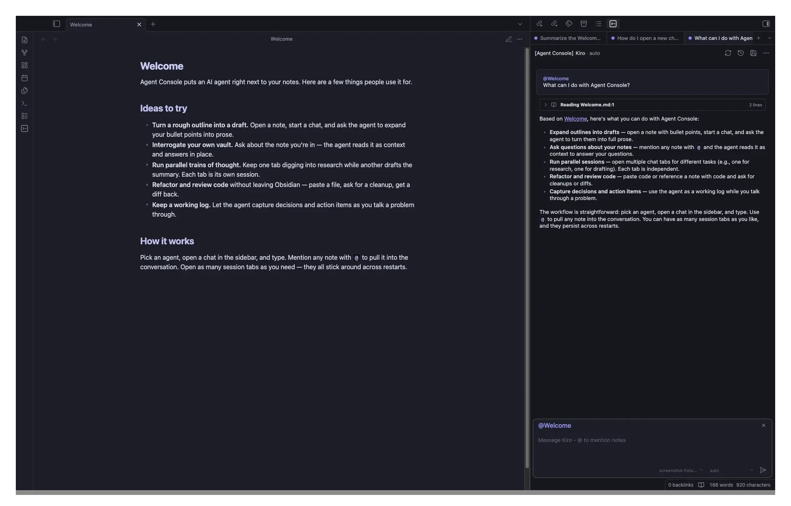

# Agent Console

> Your Obsidian console for parallel agent work.

  

## Why Agent Console

AI agents can do real work for you. Research a topic. Write code. Draft an email. Plan a meeting. But the work takes time. While the agent works, you wait. Or you switch to another app, lose your place, and have to find it again.

Agent Console fixes that. Open a tab. Tell the agent what you want. While it works, open another tab and start something else. Each tab shows whether the agent is still working, waiting on you, or done. Your notes stay in view the whole time. The conversation lives where you already think.

> **The shift in how you work:** Tell the agent *what you want done*, not *how to do it*. With the right [skills](https://agentskills.io/home), the agent figures out the steps. You stay focused on the work itself. With many tabs, you can have several things happening at once, without losing track.

## Features

* **Stop waiting on one agent before starting the next** – run several agent chats side by side in one sidebar
* **See what every agent is doing without clicking around** – status icons show ready, busy, waiting on you, or stuck
* **Switch tabs without touching the mouse** – assign whatever hotkeys feel right under Obsidian’s hotkey settings
* **Reorganize on the fly** – right-click to rename or close tabs, drag to reorder
* **Give the agent context from your vault** – type `@notename` and the agent reads that note. Drag in images. Use slash commands.

<strong>More features</strong>

* **Pick up exactly where you left off** – tabs remember their scroll position when you switch back
* **Restart Obsidian without losing your place** – your open tabs and their conversations reopen exactly as you left them; each sidebar pane restores its own tabs independently
* **Tabs wake up when you start typing** – opening a tab won't start an agent session until you type, so you can reread past chats without spinning one up
* **Read the conversation, not the logs** – tool calls render as a single tappable summary row by default. Click to expand, click to collapse, errors auto-expand so you don't miss them.
* **Use the agent you’ve already set up** – Kiro CLI, Claude Code, Codex, Gemini CLI, or any custom agent built on the [Agent Client Protocol](https://github.com/zed-industries/agent-client-protocol)
* **Pick the right model for each task** – switch modes and models per chat without restarting
* **Find old chats and continue them** – browse session history and reopen any past conversation in a tab
* **Your agent’s tools just work** – any MCP tool your agent uses keeps working in Agent Console with no extra setup

## What you can do with it

* **Do several things at once** – ask one agent to research a topic, another to prep your next meeting, a third to clean up your email. Each one works at its own pace.
* **Don’t wait on code** – have one agent fix a bug while another writes the tests
* **Pull in your notes** – type `@` and the name of any note – meeting notes, contact info, project pages – and the agent uses it as context for the task
* **Make your vault fill itself** – with the right skills, agents write meeting notes, research summaries, and action items straight into your vault. No manual capture.
* **Compare two agents** – give the same task to two different agents in side-by-side tabs and see which answer you like better
* **Stay focused** – status icons tell you when an agent is ready or still working, so you don’t break your flow checking on it

The pattern: tell the agent what you want done. Switch tabs. Come back when status says ready.

## Install

### Through Obsidian Community Plugins (recommended)

Agent Console is in the Obsidian Community Plugins store:

1. Open **Settings → Community plugins** in Obsidian
2. Click **Browse** and search for "Agent Console"
3. Click **Install**, then **Enable**

Obsidian updates the plugin automatically when a new version is released.

### Through BRAT (latest beta builds)

Want new releases the moment they ship, before they reach the store? Install through [BRAT](https://github.com/TfTHacker/obsidian42-brat):

1. Install the BRAT plugin in Obsidian
2. Open BRAT settings → "Add Beta Plugin"
3. Paste: `donivatamazondotcom/obsidian-agent-console`
4. Turn on Agent Console in your Community Plugins list

BRAT auto-updates on every release.

## Quick start

You’ll need an AI agent installed on your computer. Popular choices:

* [Kiro CLI](https://kiro.dev) – Amazon's agent
* [Claude Code](https://docs.anthropic.com/claude/docs/claude-code) – Anthropic’s coding agent
* [Codex](https://github.com/zed-industries/codex-acp) – Zed’s reference agent
* [Gemini CLI](https://github.com/google-gemini/gemini-cli) – Google’s command-line agent
* Custom agents like OpenCode, Qwen Code, Mistral Vibe, and others

Once you’ve set up the agent:

1. Open **Settings → Agent Console**
2. Enter the path to the agent and any API keys it needs
3. Click the robot icon in the ribbon to open the chat panel
4. Click the **+** button to open more tabs as you need them

## Configuration

Customize how each agent behaves under **Settings → Agent Console** – agent paths, modes, models, permissions, and tab behavior. Per-agent setup guides are in the [documentation](https://donivatamazondotcom.github.io/obsidian-agent-console/).

## Hotkeys

Move between tabs with a keystroke instead of the mouse. Set your preferred bindings under **Settings → Hotkeys**.

## How it works with your agent

Three things come together, and you control all of them:

* **Your notes give the agent context** – it reads notes, mentions, and attachments from your vault, so it works with your knowledge instead of starting from scratch
* **Your agent stays itself** – task instructions, custom rules, tools – Agent Console doesn’t get in the way of anything your agent already supports
* **Agent Console keeps everything running** – many tabs, status icons, parallel chats. The piece that lets you do more without losing track.

Whatever your agent can do, Agent Console lets you do many of those at once.

## Contributing

Issues and pull requests are welcome on the [GitHub repo](https://github.com/donivatamazondotcom/obsidian-agent-console).

For a big new feature, please file an issue first so we can talk about scope. Bug fixes can go straight to a pull request.

## License and Attribution

Apache License 2.0 – see [LICENSE](LICENSE).

Agent Console is based on [Agent Client](https://github.com/RAIT-09/obsidian-agent-client) by [@RAIT-09](https://github.com/RAIT-09), originally released under Apache-2.0. Changes are © Vinod Panicker. See [NOTICE](NOTICE) for full credits.

The Agent Client Protocol is developed by [Zed Industries](https://github.com/zed-industries/agent-client-protocol).
